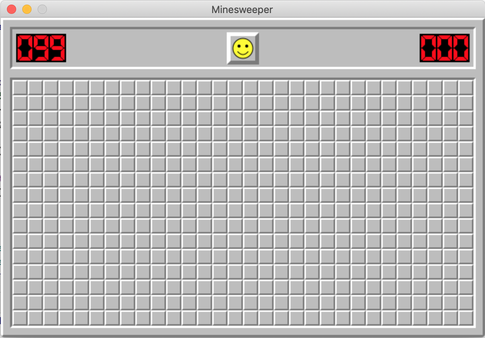

# Overview

[Minesweeper](https://en.wikipedia.org/wiki/Microsoft_Minesweeper) is an iconic puzzle game 
that has been included with the Windows operating systems since Windows 3.1.

This repository contains a simplified replica of Minesweeper implemented in C++ 
with the use of the [Simple DirectMedia Layer](https://www.libsdl.org/) library.

# Requirements
* C++17+
* [CMake 3.15+](https://cmake.org/)
* [SDL2](https://www.libsdl.org/)

# Build    

Generate `Makefile` with `cmake`:
```$bash
cmake .
```

Compile and build executable:
```$bash
make
```

# Run

Run minesweeper!
```$bash
./minesweeper
```

# Screenshot

